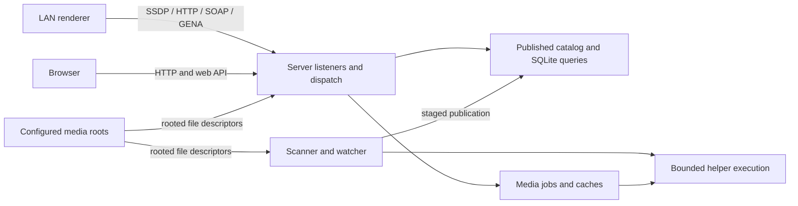

# Architecture — rustyDLNA

## Overview

rustyDLNA is a standalone DLNA / UPnP server for a local media library on Linux.
The eight-crate Rust workspace serves discovery, protocol, catalog, and playback
behavior. HTML, CSS, and JavaScript under `crates/server/web/` are embedded in the
server binary. The operator tools in `contrib/library/` are separate programs.
This overview follows `README.md` and the project index in `AGENTS.md`; the linked
product guides remain authoritative for detailed behavior.

## Layout

- `crates/helper/` — bounded helper processes and cancellation
- `crates/protocol/` — shared wire constants and pure protocol behavior
- `crates/ssdp/`, `crates/http/`, `crates/soap/` — protocol parsing and responses
- `crates/scan/` — scanning, watching, metadata, and SQLite persistence
- `crates/transcode/` — media policy and controlled FFmpeg execution
- `crates/server/` — configuration, listeners, dispatch, and embedded web player
- `contrib/library/` — operator-owned library maintenance tools
- `web-gateway/` — separate nginx browser gateway configuration
- `web-tests/`, `testdata/`, `fuzz/` — browser tests, fixtures, and fuzz targets
- `scripts/` — quality checks, benchmarks, and deployment utilities
- `docs/` — current product and operational guides

## Context diagram

Network requests, renderer descriptions, media, and sidecars are untrusted.
The server validates request framing and host/callback addresses. Configured-root
I/O pins authorized regular-file descriptors for later reading and helper use.
The optional nginx browser gateway exposes the browser routes; an outer proxy
provides authentication and TLS for remote access.

## Key flows

The scanner prepares filesystem and metadata changes in a private staging
catalog. Publication commits the catalog mutation and generation, updates the
in-memory view, and notifies ContentDirectory subscribers. HTTP and SOAP
queries use the published generation so readers do not see half a scan.

Original playback serves an authorized file with byte ranges. Compatible
playback negotiates video and audio independently and attaches bounded jobs
that produce fragmented MP4. The server tracks producer state, request owners,
and reconnect grace; cache publication follows successful completion and
validation. Failures and cancellation cannot publish reusable partial output.

In the browser, source selection produces a plan, one source owns its
asynchronous work, and the player controller coordinates user actions and
global time with the store. Decoder errors, resource failures, and premature
completion share recovery. Source cancellation removes listeners and timers;
only controller-owned seek/retry delays can schedule a replacement. See
[playback source ownership](adr/0002-playback-source-ownership.md).

## Data

SQLite stores the catalog and Kodi bookmarks. Writable cache storage holds the
server identity, artwork, derived images, and compatible output. The browser
keeps preferences and resume progress in local storage. Media roots remain
read-only to the server.

The server serves a local library without an online metadata service. Separate
operator tools in `contrib/library/` can use providers and write metadata,
artwork, generated views, and previews beside media. They have their own
configuration and credential handling.

## Non-goals

See [Compatibility](./COMPATIBILITY.md) and the README's product exclusions.

## References

- [Documentation index](./INDEX.md)
- [Protocol contract](./PROTOCOL_CONTRACT.md)
- [Web player](./WEB_PLAYER.md)
- [Transcode](./TRANSCODE.md)
- [Operations](./OPERATIONS.md)
- [ADRs](./adr/)
- [Agent contract](../AGENTS.md)
